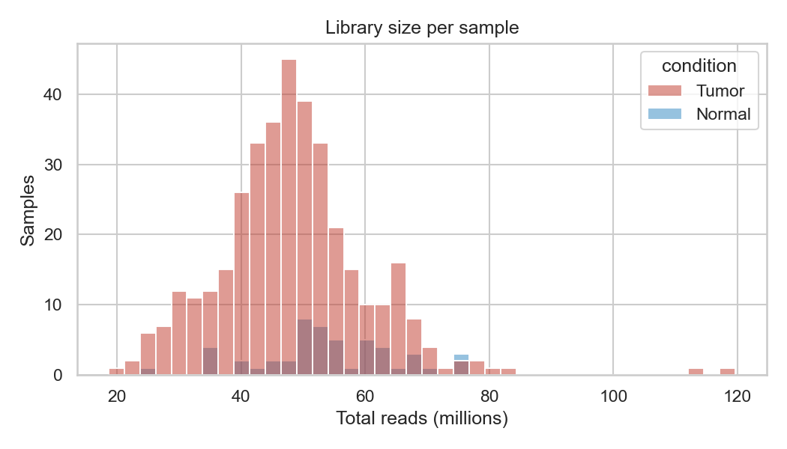
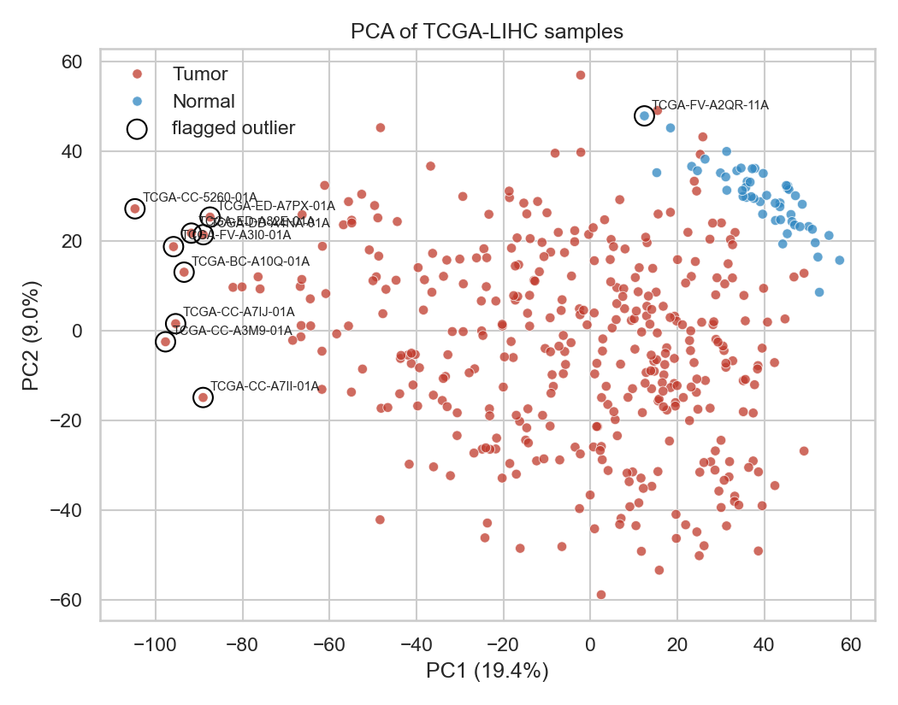
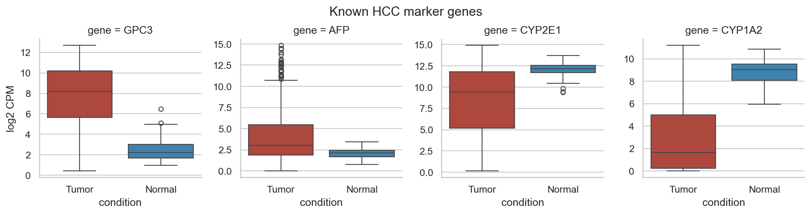
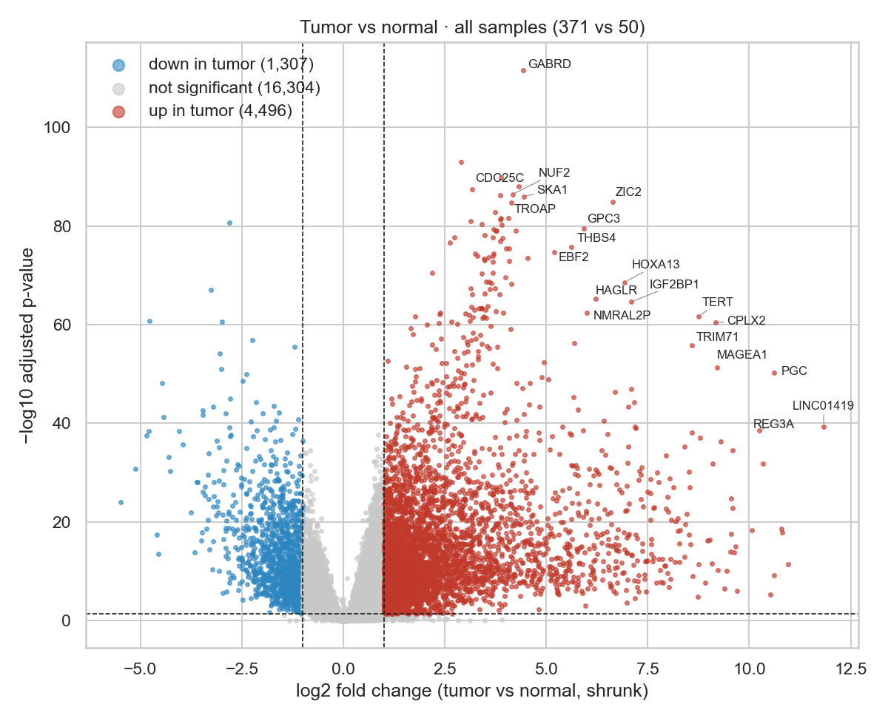
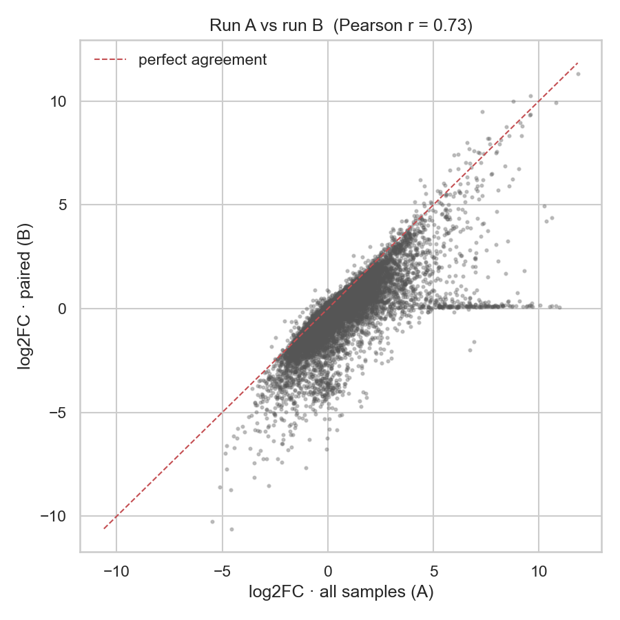
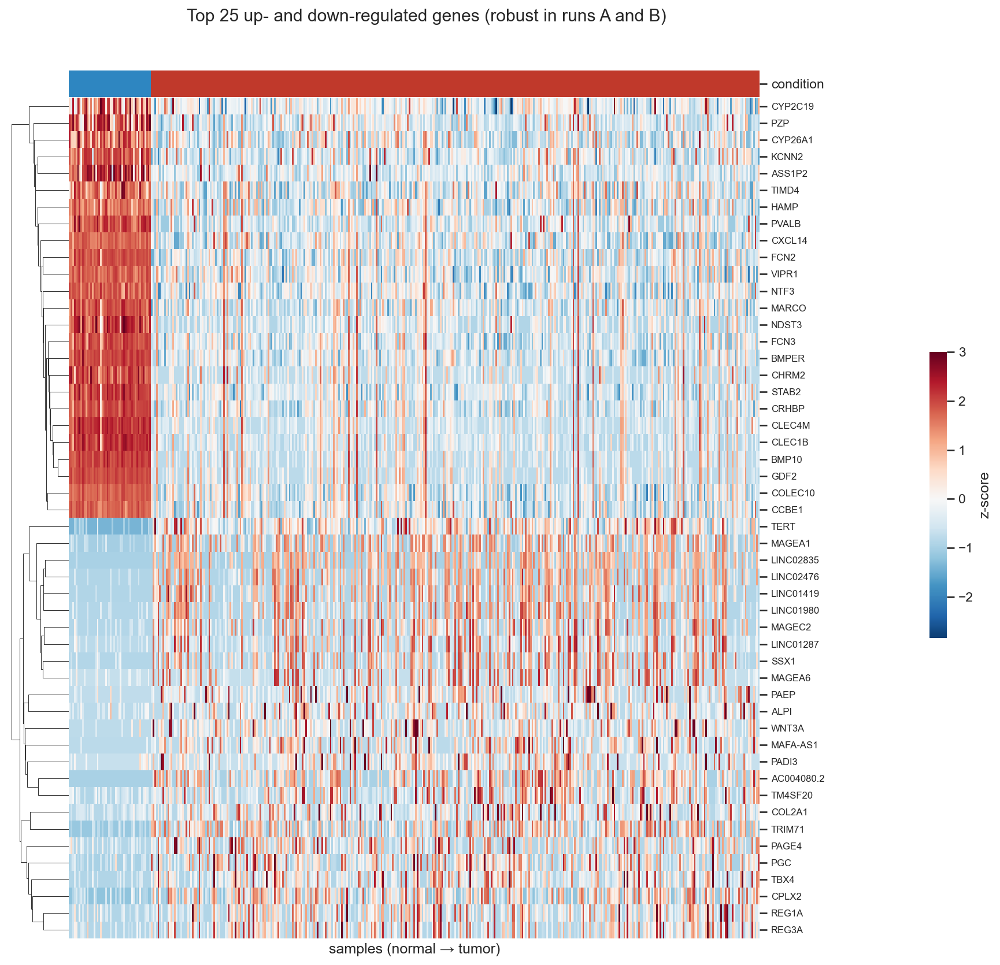
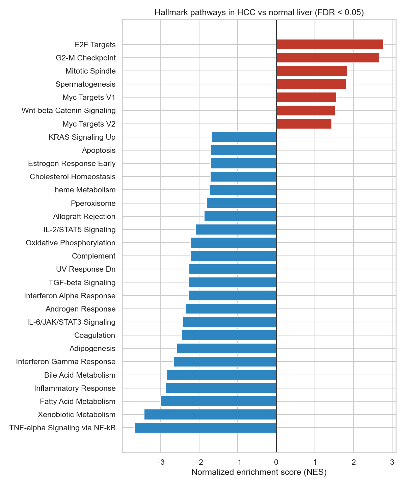
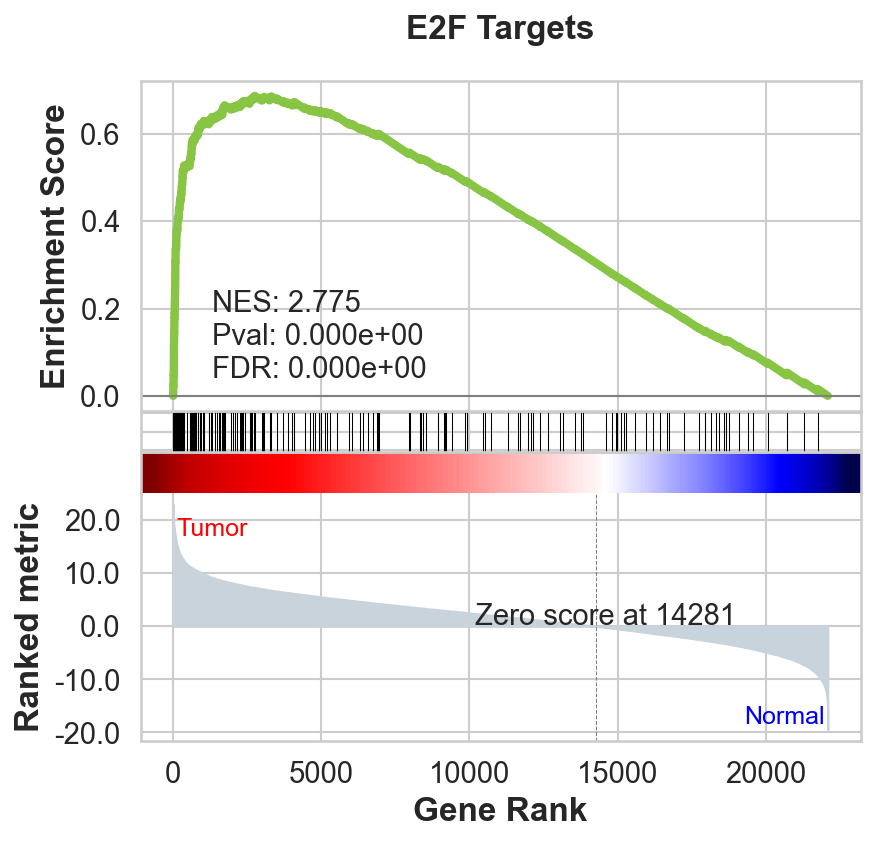
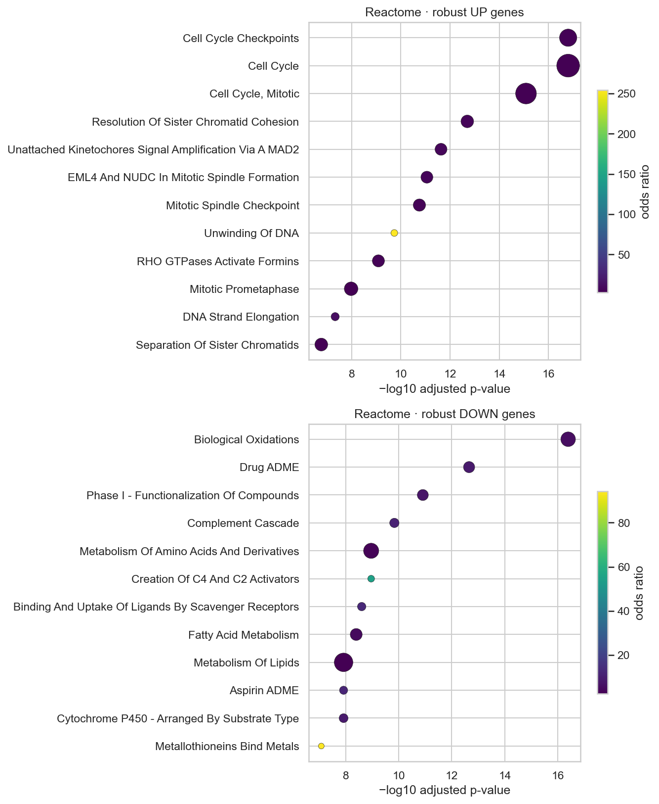

# Identifying Candidate Drug Targets in Hepatocellular Carcinoma from TCGA RNA-seq Data

**Author:** Milica Jeftic, Bioinformatics, University of Primorska (UP FAMNIT)
**Status:** In progress. Sections 1–5 (data, quality control, differential expression, pathway enrichment) are complete.

---

## Contents

1. [Introduction](#1-introduction)
2. [Data](#2-data)
3. [Quality control](#3-quality-control)
4. [Differential expression](#4-differential-expression)
5. [Pathway enrichment](#5-pathway-enrichment)
6. Survival analysis _(coming)_
7. Druggability assessment _(coming)_
8. [Limitations](#8-limitations)
9. [References](#9-references)

---

## 1. Introduction

Hepatocellular carcinoma (HCC) is the most common form of primary liver cancer and a leading cause of cancer-related death worldwide. Most patients are diagnosed at an advanced stage, when surgery is no longer an option, and the available systemic therapies extend survival only modestly. There is a clear need for new therapeutic targets.

This project uses publicly available RNA-seq data from The Cancer Genome Atlas (TCGA) to look for genes that meet three criteria:

1. **Overexpressed** in tumor compared with adjacent non-tumor liver
2. **Associated with worse overall survival** in patients
3. **Druggable**, meaning the protein belongs to a class that small molecules or antibodies can realistically target, or already has known compounds

Genes meeting all three are proposed as candidate drug targets. These are computational hypotheses and would require experimental validation.

---

## 2. Data

| Item | Details |
|---|---|
| Cohort | TCGA-LIHC (Liver Hepatocellular Carcinoma) |
| Access | UCSC Xena GDC hub |
| Expression | STAR gene-level read counts, GENCODE v36 annotation (60,660 genes) |
| Survival | Overall survival status (`OS`) and time in days (`OS.time`) |
| Clinical | 439 records, 83 variables, including pathologic stage, tumor grade, sex and age |

Xena provides counts as log2(count + 1). These were back-transformed to integer counts, which count-based methods such as DESeq2 require.

---

## 3. Quality control

_Notebook: `notebooks/01_data_download_and_qc.ipynb`_

### 3.1 Sample selection

Sample type was taken from the TCGA barcode (positions 14–15): `01` = primary tumor, `11` = solid tissue normal. Recurrent tumors and other sample types were excluded. Where a patient had more than one aliquot of the same sample type, one was kept (first vial alphabetically) so that no patient is counted twice.

| Group | Samples |
|---|---|
| Primary tumor | 371 |
| Adjacent normal liver | 50 |
| Patients with both tumor and normal | 50 (all normal samples have a matched tumor) |

### 3.2 Library size

Library size (total reads per sample) was checked to identify failed or unusual sequencing runs.

| Group | Mean (M reads) | Median | Min | Max |
|---|---|---|---|---|
| Tumor | 48.3 | 47.9 | 18.6 | 119.7 |
| Normal | 54.0 | 52.8 | 25.0 | 76.7 |

No sample had a library size low enough to suggest a failed run. Two tumor samples had unusually high depth (~115–120 M reads). This is not a problem, because DESeq2 normalization corrects for sequencing depth.

### 3.3 Gene filtering

Genes with very low counts carry little information and increase the multiple-testing burden. A gene was kept if it had **at least 10 counts in at least 50 samples**, where 50 is the size of the smaller group (normals). This threshold keeps genes expressed only in normal tissue.

**Result:** 22,107 of 60,660 genes (36%) were kept. This proportion is typical, because many annotated genes (pseudogenes and tissue-specific genes) are not expressed in liver.

### 3.4 Principal component analysis

For visualization only, counts were normalized to log2 counts-per-million, and PCA was run on the 2,000 most variable genes.

- **PC1 explains 19.4%** of the variance and **PC2 explains 9.0%**.
- Normal samples form a tight cluster, consistent with the relatively uniform expression profile of non-tumor liver.
- Tumor samples are widely spread along PC1, reflecting the known molecular heterogeneity of HCC. Tumors closest to the normal cluster may be well-differentiated or have lower tumor purity. Tumors at the opposite extreme are likely the least liver-like.

### 3.5 Outlier review

Samples were flagged if their distance from their group's median position on PC1/PC2 was more than 3 standard deviations above the group's mean distance. Flagging was used to prompt manual review, not to remove samples automatically. The removal criterion was set **before** inspecting individual samples.

| Sample | Group | Library size (M) | Distance (z) | Decision |
|---|---|---|---|---|
| TCGA-BC-A10Q-01A | Tumor | 48.3 | 3.29 | Keep |
| TCGA-CC-5260-01A | Tumor | 32.2 | 4.04 | Keep |
| TCGA-CC-A3M9-01A | Tumor | 51.1 | 3.44 | Keep |
| TCGA-CC-A7II-01A | Tumor | 50.6 | 3.02 | Keep |
| TCGA-CC-A7IJ-01A | Tumor | 53.5 | 3.32 | Keep |
| TCGA-DD-A4NA-01A | Tumor | 53.5 | 3.16 | Keep |
| TCGA-ED-A7PX-01A | Tumor | 42.0 | 3.14 | Keep |
| TCGA-ED-A82E-01A | Tumor | 56.1 | 3.30 | Keep |
| TCGA-FV-A3I0-01A | Tumor | 46.0 | 3.47 | Keep |
| TCGA-FV-A2QR-11A | Normal | 50.6 | 3.23 | Keep |

**Flagged tumors (9).** All had normal library sizes, so there is no sign of technical failure. They sit at the extreme end of the tumor distribution along PC1 and most likely represent biological heterogeneity. Removing them would selectively exclude the most distinct tumors and could bias the tumor-vs-normal comparison.

**Flagged normal (TCGA-FV-A2QR-11A).** A normal sample that sits apart from the other normals could contain tumor tissue. Pre-defined criterion for removal: tumor markers (GPC3, AFP) above the maximum of all other normal samples **and** liver metabolism genes (CYP2E1, CYP1A2) reduced.

| Gene (log2 CPM) | This sample | Normal median | Normal max | Tumor median |
|---|---|---|---|---|
| GPC3 | 3.7 | 2.2 | 6.5 | 8.2 |
| AFP | 2.5 | 2.1 | 3.4 | 3.0 |
| CYP2E1 | 10.5 | 12.2 | 13.7 | 9.5 |
| CYP1A2 | 6.0 | 9.0 | 10.9 | 1.7 |

Tumor markers are within the normal range. CYP genes are mildly reduced but still within the range of normal samples. The removal criterion was not met, so the sample was kept. Its profile is consistent with diseased adjacent liver, since TCGA normal samples often come from cirrhotic or inflamed livers. A sensitivity analysis in Section 4.4 confirmed that keeping this sample does not affect the differential expression results.

### 3.6 Marker gene validation

To confirm that sample labels and data processing are correct, four genes with well-established behavior in HCC were checked.

| Gene | Role | Expected in tumor | Observed | As expected? |
|---|---|---|---|---|
| GPC3 | Established HCC biomarker | Higher | Strongly higher | Yes |
| AFP | Clinical serum marker, elevated in a subset of HCC | Higher in a subset | High in a subset, many tumor outliers | Yes |
| CYP2E1 | Hepatocyte metabolic enzyme | Lower | Lower, more variable | Yes |
| CYP1A2 | Hepatocyte metabolic enzyme | Lower | Strongly lower | Yes |

All four genes behave as expected, supporting the correctness of sample labeling.

### 3.7 Clinical and survival data

| Item | Value |
|---|---|
| Tumor samples with survival data | 365 |
| Deaths (events) | 131 |
| Median follow-up | 19.6 months |

Relevant clinical variables are available for later adjustment: `ajcc_pathologic_stage.diagnoses`, `tumor_grade.diagnoses`, `gender.demographic` and `age_at_index.demographic`.

### 3.8 Summary

The dataset passed quality control. No samples were removed. The final dataset for downstream analysis contains **371 tumor and 50 normal samples across 22,107 genes**. Marker genes confirm the sample labels, and PCA shows the expected separation between tumor and normal tissue alongside strong tumor heterogeneity.

---

## 4. Differential expression

_Notebook: `notebooks/02_differential_expression.ipynb`_

### 4.1 Approach

Differential expression between tumor and normal tissue was tested with **PyDESeq2** [4], a Python implementation of DESeq2 [3]. DESeq2 normalizes for sequencing depth, models the natural variability of each gene, and tests whether the tumor–normal difference exceeds that variability. P-values were adjusted for multiple testing with the Benjamini–Hochberg method [5]. Log2 fold changes were shrunk [6] to reduce inflated estimates for genes with low counts or high variability.

Thresholds were set before looking at results: **adjusted p-value < 0.05 and |log2 fold change| > 1** (at least a two-fold change).

Three analyses were run:

| Run | Samples | Design | Purpose |
|---|---|---|---|
| A · main | 371 tumor, 50 normal | `~condition` | Main tumor vs normal comparison |
| B · paired | 50 patients with both tumor and normal | `~patient + condition` | Removes differences between individuals |
| C · sensitivity | Run A without `TCGA-FV-A2QR-11A` | `~condition` | Tests whether the borderline normal sample affects results |

Genes significant in the same direction in **both A and B** were defined as **robust** and carried forward.

### 4.2 Results

| Run | Up in tumor | Down in tumor |
|---|---|---|
| A · all samples | 4,496 | 1,307 |
| B · paired | 1,859 | 2,872 |
| **Robust (A and B)** | **1,842** | **1,261** |

Run A detected more upregulated genes than run B. Almost all of B's upregulated genes (1,842 of 1,859, 99%) were also found in A, but only 41% of A's were confirmed by B. With 371 tumors, run A has the power to detect genes that are strongly elevated in only a subset of tumors. The paired run, with 50 tumors, mainly detects genes that are elevated in most patients. The robust set is therefore a conservative list of consistently upregulated genes.

### 4.3 Agreement between the main and paired analyses

Log2 fold changes from runs A and B were correlated (**Pearson r = 0.73**), with the main cloud of genes following the diagonal. Two features lower the correlation:

- **A horizontal streak** of genes with large fold changes in A (log2FC 5–11) but near zero in B. These genes are very highly expressed in a small number of tumors. In the smaller paired analysis the evidence was insufficient, and shrinkage pulled their estimates toward zero. They are excluded from the robust set.
- **A slight downward shift** of paired fold changes. This is likely caused by normalization being computed on different sample sets (100 vs 421 samples), and it is consistent with run B detecting fewer up and more down genes.

### 4.4 Sensitivity analysis

Removing the borderline normal sample `TCGA-FV-A2QR-11A` (see Section 3.5) had almost no effect:

| Metric | Value |
|---|---|
| Correlation of log2FC with vs without the sample | r = 0.9995 |
| Upregulated genes (with / without) | 4,496 / 4,516 |
| Overlap of top 200 upregulated genes | 196 / 200 |

The decision to keep the sample did not influence the results.

### 4.5 Top genes and biological interpretation

The most significant upregulated genes are dominated by **cell-cycle and proliferation genes** (CDKN3, CDC25C, UBE2T, NUF2, CENPF, SKA1, TROAP), reflecting the uncontrolled cell division of cancer cells.

Several genes with established roles in HCC were recovered without prior selection, supporting the validity of the analysis:

| Gene | Relevance to HCC |
|---|---|
| GPC3 | Established HCC biomarker (also used in QC, Section 3.6) |
| TERT | Telomerase; TERT alterations are among the most frequent genetic events in HCC |
| IGF2BP1 | RNA-binding oncofetal protein associated with aggressive HCC |
| HOXA13 | Developmental transcription factor associated with HCC progression |
| REG3A (HIP/PAP) | Protein originally identified in hepatocellular carcinoma |
| PLVAP | Marker of tumor blood vessels in HCC; studied as a therapeutic antibody target |
| MAGEA1 | Cancer-testis antigen, normally restricted to testis |

**Points for the next stages:**

- The genes with the largest fold changes (e.g. LINC01419, AC004080.2) include **non-coding RNAs**, which are not accessible to conventional drugs. They will be removed in the druggability assessment.
- Some genes with very large fold changes in run A (e.g. PGC, REG1A, REG3A) showed much smaller changes in the paired analysis (log2FC about 4 vs 10), suggesting very high expression in a subset of tumors. Because a good therapeutic target should be elevated in most patients, the **fraction of tumors with expression above the normal range** will be used alongside fold change when ranking candidates.

**Output:** 1,842 robust upregulated genes were saved to `results/de_upregulated_robust.csv` for survival analysis.

---

## 5. Pathway enrichment

_Notebook: `notebooks/03_pathway_enrichment.ipynb`_

### 5.1 Approach

Two complementary methods were used to move from individual genes to biological processes:

| Method | Input | Gene sets | Tool |
|---|---|---|---|
| **GSEA** (gene set enrichment analysis) [7] | All 22,094 genes ranked by the DESeq2 Wald statistic from run A | MSigDB Hallmark, 50 sets [8] | `gseapy.prerank` [9], 1,000 permutations |
| **ORA** (over-representation analysis) | Robust up (1,842) and robust down (1,261) genes | Reactome [10] | `gseapy.enrich`, hypergeometric test |

GSEA uses every gene and needs no significance cut-off: it tests whether the genes of a pathway are concentrated at the top (activated in tumor) or bottom (suppressed) of the ranking. ORA tests whether a pathway appears in the robust gene lists more often than expected by chance. For ORA, the **background** was set to all genes tested in the differential expression analysis rather than the whole genome. Otherwise, liver-expressed genes would appear enriched simply because they are expressed in liver. Gene sets were obtained through Enrichr [11]. Pathways with FDR < 0.05 were considered significant.

### 5.2 Hallmark GSEA

**7 pathways were activated and 23 suppressed** in tumors (FDR < 0.05).

**Activated in tumor:**

| Theme | Pathways | Interpretation |
|---|---|---|
| Cell proliferation | E2F Targets (NES 2.78), G2-M Checkpoint, Mitotic Spindle | DNA replication and cell division, largely inactive in normal adult liver |
| Growth signaling | Myc Targets V1 and V2 | MYC-driven cell growth programs |
| Wnt/β-catenin | Wnt-beta Catenin Signaling | One of the most frequently altered pathways in HCC (e.g. CTNNB1 mutations) [1] |
| Other | Spermatogenesis | Overlaps with cell-division genes and includes cancer-testis genes (e.g. MAGEA1, Section 4.5) |

The E2F Targets enrichment plot shows pathway genes packed at the very top of the ranking, with a sharp early peak in the running enrichment score.

**Suppressed in tumor** — two main themes:

1. **Loss of normal liver function:** Xenobiotic Metabolism, Fatty Acid Metabolism, Bile Acid Metabolism, Adipogenesis, Peroxisome, Coagulation, Complement, Cholesterol Homeostasis, Heme Metabolism, Oxidative Phosphorylation. Tumor cells lose the specialized metabolic functions of hepatocytes, consistent with the reduced CYP2E1 and CYP1A2 expression seen in QC (Section 3.6).
2. **Immune and inflammatory signaling:** TNF-alpha Signaling via NF-kB (the most strongly suppressed, NES ≈ −3.6), Inflammatory Response, Interferon Gamma and Alpha Response, IL-6/JAK/STAT3, IL-2/STAT5, Allograft Rejection, TGF-beta Signaling.

The immune signal should be interpreted with care. It is likely driven by two factors:

- **Tissue composition.** Adjacent "normal" liver in HCC patients often has chronic hepatitis or cirrhosis and is rich in immune cells, while many HCC tumors have relatively few immune cells.
- **Tissue-handling stress in normal samples.** The TNF-alpha/NF-kB gene set contains immediate-early stress-response genes that are induced within minutes of tissue removal. One of these, CSRNP1, is among the most downregulated genes in the ranking, suggesting part of this signal may reflect sample handling rather than tumor biology.

### 5.3 Reactome ORA

**82 Reactome pathways were enriched among robust up genes and 122 among robust down genes** (adjusted p < 0.05).

- **Up genes** are dominated by cell-cycle pathways: Cell Cycle Checkpoints (71/255 genes), Cell Cycle, Mitotic (103/496), Resolution of Sister Chromatid Cohesion, Mitotic Spindle Checkpoint, and kinetochore signaling. **Unwinding of DNA** stands out: all 11 genes of this small pathway, the MCM replicative helicase complex, are upregulated, giving a very high odds ratio (254).
- **Down genes** are dominated by liver metabolism: Biological Oxidations, Drug ADME, Phase I Functionalization of Compounds, Cytochrome P450, Metabolism of Lipids, Fatty Acid Metabolism, Metabolism of Amino Acids, and the Complement Cascade. Scavenger receptor pathways (including liver sinusoidal endothelial genes such as STAB2) and Metallothioneins Bind Metals are also reduced.

GSEA and ORA agree: **tumors gain proliferation and lose hepatocyte identity**.

### 5.4 Linking pathways to candidate genes

For each significantly activated Hallmark pathway, the **leading-edge genes** (the genes driving the enrichment signal) were extracted and matched to the robust upregulated gene list.

**134 of 1,842 robust upregulated genes** are leading-edge genes of at least one activated Hallmark pathway. Examples:

| Gene | log2FC | Pathway(s) | Note |
|---|---|---|---|
| DKK1 | 5.76 | Wnt-beta Catenin Signaling | Secreted Wnt regulator; has been developed as an antibody target in other cancers |
| DKK4 | 4.85 | Wnt-beta Catenin Signaling | Wnt target gene |
| EGF | 4.65 | G2-M Checkpoint | Growth factor |
| MYBL2 | 4.54 | E2F Targets; G2-M Checkpoint | Cell-cycle transcription factor |
| CDC20 | 4.25 | E2F Targets; G2-M Checkpoint; Myc Targets V1 | Mitotic regulator |

This annotation is saved in `results/candidates_with_pathways.csv` and will be used to explain the biological role of the final candidate targets.

### 5.5 Summary

Pathway analysis confirms the gene-level findings with an independent method. HCC tumors show strong activation of cell proliferation, MYC and Wnt/β-catenin programs, and broad loss of normal hepatocyte metabolic functions. Suppression of immune and inflammatory pathways likely reflects both immune-rich diseased adjacent liver and tissue-handling effects in normal samples. Proliferation and Wnt/β-catenin genes form a biologically coherent pool of candidates for survival analysis.

---

## 8. Limitations

- **Adjacent normal is not healthy liver.** Normal samples come from non-tumor tissue of cancer patients, often with cirrhosis or hepatitis. Some tumor-vs-normal differences may be underestimated.
- **Bulk RNA-seq.** Each sample is a mixture of tumor, immune and stromal cells, so some signal may come from non-cancer cells, and tumor purity varies between samples.
- **Imbalanced groups.** There are 371 tumors vs 50 normals.
- **Tumor heterogeneity.** Some genes are extremely high in only a subset of tumors. Fold change alone can overstate how broadly a gene is overexpressed.
- **Sample handling effects.** Stress-response genes in adjacent normal samples may partly reflect time between tissue removal and preservation, which can inflate apparent differences in inflammatory pathways.
- **Short follow-up.** Median follow-up is 19.6 months. With 131 deaths among 365 patients, survival analysis is still reasonably powered, but long-term effects may be missed.
- **mRNA ≠ protein ≠ dependency.** High mRNA expression does not guarantee high protein levels or that the tumor depends on the gene.

---

## 9. References

1. Cancer Genome Atlas Research Network. Comprehensive and integrative genomic characterization of hepatocellular carcinoma. *Cell* 169, 1327–1341 (2017).
2. Goldman, M. J. et al. Visualizing and interpreting cancer genomics data via the Xena platform. *Nature Biotechnology* 38, 675–678 (2020).
3. Love, M. I., Huber, W. & Anders, S. Moderated estimation of fold change and dispersion for RNA-seq data with DESeq2. *Genome Biology* 15, 550 (2014).
4. Muzellec, B., Teleńczuk, M., Cabeli, V. & Andreux, M. PyDESeq2: a python package for bulk RNA-seq differential expression analysis. *Bioinformatics* 39, btad547 (2023).
5. Benjamini, Y. & Hochberg, Y. Controlling the false discovery rate: a practical and powerful approach to multiple testing. *Journal of the Royal Statistical Society: Series B* 57, 289–300 (1995).
6. Zhu, A., Ibrahim, J. G. & Love, M. I. Heavy-tailed prior distributions for sequence count data: removing the noise and preserving large differences. *Bioinformatics* 35, 2084–2092 (2019).
7. Subramanian, A. et al. Gene set enrichment analysis: a knowledge-based approach for interpreting genome-wide expression profiles. *PNAS* 102, 15545–15550 (2005).
8. Liberzon, A. et al. The Molecular Signatures Database (MSigDB) hallmark gene set collection. *Cell Systems* 1, 417–425 (2015).
9. Fang, Z., Liu, X. & Peltz, G. GSEApy: a comprehensive package for performing gene set enrichment analysis in Python. *Bioinformatics* 39, btac757 (2023).
10. Milacic, M. et al. The Reactome Pathway Knowledgebase 2024. *Nucleic Acids Research* 52, D672–D678 (2024).
11. Kuleshov, M. V. et al. Enrichr: a comprehensive gene set enrichment analysis web server 2016 update. *Nucleic Acids Research* 44, W90–W97 (2016).
